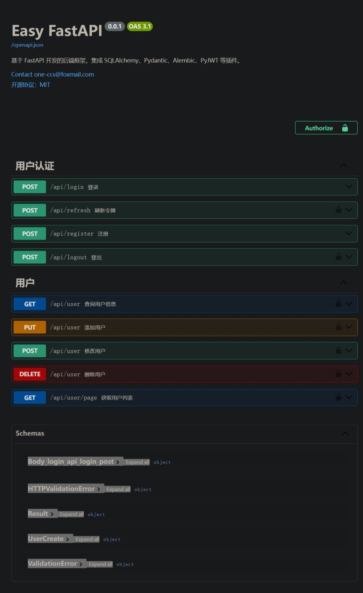

# Easy FastAPI

基于 FastAPI 开发的后端框架，集成了 SQLAlchemy、Pydantic、Alembic、PyJWT、PyYAML、Redis 等插件，旨在提供一个高效、易用的后端开发环境。该框架通过清晰的目录结构和模块化设计，帮助开发者快速构建和部署后端服务。



## 一、主要特点

1. 集成多种插件：集成了 SQLAlchemy（数据库 ORM）、Pydantic（数据验证和序列化）、Alembic（数据库迁移）、PyJWT（JWT 认证）、PyYAML（项目配置读取）、Redis（登出黑名单） 等常用插件，提升开发效率。
2. 清晰的目录结构：通过明确的目录划分，如核心配置、数据库模型、路由、数据结构、事务处理和工具函数等，使项目结构清晰，便于维护和扩展。
3. 认证授权：内置认证授权模块，支持 JWT 认证，保障系统安全。
4. 数据库迁移支持：利用 Alembic 进行数据库迁移，支持自动生成迁移文件和更新数据库，确保数据库结构与代码同步。

## 二、目录结构说明

```plaintext
project-root/
│
├─ backend/  # 后端项目目录（python 3.12.4）
│   ├─ app/      # fastapi 项目目录
│   │   ├─ alembic/  # 数据迁移目录
│   │   │   ├─ versions   # 数据库迁移版本文件
│   │   │   ├─ env.py     # 环境配置文件
│   │   │   └─ ...
│   │   │
│   │   ├─ core/  # 核心配置文件
│   │   │   ├─ exceptions/   # 异常类目录
│   │   │   │   └─ *_exception.py        # 自定义异常类
│   │   │   │
│   │   │   ├─ authorization.py     # 认证授权相关配置
│   │   │   ├─ config.py            # 项目配置
│   │   │   ├─ db.py                # 数据库配置
│   │   │   ├─ exception_handler.py # 错误处理器
│   │   │   ├─ redis.py             # redis 配置
│   │   │   ├─ result.py            # 响应体数据类
│   │   │   └─ yaml.py              # yaml 配置
│   │   │
│   │   ├─ models/     # 数据库模型目录
│   │   │   ├─ crud         # 数据库 crud 函数目录
│   │   │   │   ├─ *_crud.py        # 对应类的数据库操作函数
│   │   │   │   └─ ...
│   │   │   │
│   │   │   ├─ *.py         # 数据库模型（user、role 等）
│   │   │   └─ ...
│   │   │
│   │   ├─ routers/    # 路由目录（定义路由相关信息）
│   │   │   ├─ *_router.py  # 路由（user_router、role_router 等）
│   │   │   └─ ...
│   │   │
│   │   ├─ schemas/    # pydantic 数据结构目录（定义请求响应参数结构）
│   │   │   ├─ *_schema.py  # 参数结构定义
│   │   │   └─ ...
│   │   │
│   │   ├─ services/   # 事务处理目录（实现路由对应的逻辑）
│   │   │   ├─ *_service.py # 事务逻辑处理函数（user_service 等）
│   │   │   └─ ...
│   │   │
│   │   ├─ utils/      # 工具函数目录
│   │   │   ├─ crud_utils # 数据库 crud 工具函数
│   │   │   │   ├─ datetime_util.py # 日期时间相关工具类
│   │   │   │   ├─ object_util.py   # 对象相关工具类
│   │   │   │   ├─ path_util.py     # 路径相关工具类
│   │   │   │   ├─ string_util.py   # 字符串相关工具类
│   │   │   │   └─ ...
│   │   │   │
│   │   │
│   │   ├─ __init__.py      # 导入路、初始化配置、导入错误处理
│   │   ├─ alembic.ini      # 数据库迁移配置文件
│   │   ├─ easy_fastapi.py  # 配置文件
│   │   ├─ main.py          # 程序入口
│   │   └─ requirements.txt # 依赖列表
│   │
│   ├─ logs/ # 日志目录
│   │   ├─  access.log      # 访问日志
│   │   └─  default.log     # 默认日志
│   │
│   ├─ test/  # 测试目录
│   │   ├─  test_authorization_router.py  # 认证授权测试文件
│   │   └─  test_*.py                     # 其他测试文件
│   │
│   └─ uvicorn_log_config.json  # uvicorn 日志配置
│
├─ frontend/ # 前端项目目录
│   └─ ...
│
├─ license   # MIT 开源协议
├─ readme.md # 工程自述
└─ ...
```

## 三、规约

1. 所有非 200 响应均 raise 对应异常

正例：

```python
if not verify_password(form_data.password, user.hashed_password):
        raise FailureException('密码错误')
```

反例：

```python
if not verify_password(form_data.password, user.hashed_password):
        return JSONResponseResult.failure('密码错误')
```

## 四、部署

1. 安装依赖 `cd backend/app && pip install -r requirements.txt`
2. 修改 `backend/app/easy_fastapi.yaml` 中相关配置
3. 创建数据库
4. 初始化数据库 `alembic upgrade head`
5. 创建 `backend/logs` 目录
6. 启动项目 `cd backend && uvicorn app:app --reload` 或 `cd backend && uvicorn app:app --reload --log-config uvicorn_log_config.json --log-level info`

## 五、测试

1. 在 `backend/test` 目录中添加测试文件
2. 运行 `cd backend/test && pytest` 查看测试结果

## 六、数据库迁移插件 alembic

### 1、环境搭建

#### 1）初始化仓库

在后端项目目录中执行命令 `alembic init alembic` 创建一个名为 alembic 的仓库

#### 2）创建（ORM）类

略……

#### 3）修改配置文件

1. 注释 alembic.ini 中的 sqlalchemy.url
2. 修改 eny.py 文件

```python
# fileConfig(config.config_file_name)
fileConfig(config.config_file_name, encoding='utf-8')
```

```python
# target_metadata = None
import sys
sys.path.append(__file__[:__file__.index('backend') + len('backend')])
from app.models import Base
from app.core import config as app_config

target_metadata = Base.metadata
```

```python
def get_url():
    return app_config.DATABASE_URI


def run_migrations_offline() -> None:
    """Run migrations in 'offline' mode.

    This configures the context with just a URL
    and not an Engine, though an Engine is acceptable
    here as well.  By skipping the Engine creation
    we don't even need a DBAPI to be available.

    Calls to context.execute() here emit the given string to the
    script output.

    """
    url = get_url()
    context.configure(
        url=url,
        target_metadata=target_metadata,
        literal_binds=True,
        dialect_opts={"paramstyle": "named"},
    )

    with context.begin_transaction():
        context.run_migrations()


def run_migrations_online() -> None:
    """Run migrations in 'online' mode.

    In this scenario we need to create an Engine
    and associate a connection with the context.

    """
    configuration = config.get_section(config.config_ini_section)
    configuration["sqlalchemy.url"] = get_url()
    connectable = engine_from_config(
        configuration,
        prefix="sqlalchemy.",
        poolclass=pool.NullPool,
    )

    with connectable.connect() as connection:
        context.configure(
            connection=connection, target_metadata=target_metadata
        )

        with context.begin_transaction():
            context.run_migrations()
```

### 2、迁移

#### 1）生成迁移文件

使用命令 `alembic revision --autogenerate -m "message"` 可以将当前模型中的状态生成迁移文件。

#### 2）更新数据库

使用 `alembic upgrade head` 将刚刚生成的迁移文件，真正映射到数据库中。同理，如果要降级，那么使用 `alembic downgrade head` 。

#### 3）重复

如果以后修改了代码，则重复4~5的步骤。

### 3、回退迁移

#### 1）回退到指定版本

使用命令 `alembic downgrade <version>` 回退到指定版本。

#### 2）回退到上一个版本

使用命令 `alembic downgrade -1` 回退到上一个版本。

#### 3）回退到初始版本

使用命令 `alembic downgrade base` 回退到初始版本。

### 4、命令和参数解释：

- init：创建一个 `alembic` 仓库。
- revision：创建一个新的版本文件。
- –-autogenerate：自动将当前模型的修改，生成迁移脚本。
- -m：本次迁移做了哪些修改，用户可以指定这个参数，方便回顾。
- upgrade：将指定版本的迁移文件映射到数据库中，会执行版本文件中的 `upgrade` 函数。如果有多个迁移脚本没有被映射到数据库中，那么会执行多个迁移脚本。
- [head]：代表最新的迁移脚本的版本号。
- downgrade：会执行指定版本的迁移文件中的 `downgrade` 函数。
- heads：展示head指向的脚本文件版本号。
- history：列出所有的迁移版本及其信息。
- current：展示当前数据库中的版本号。

另外，在你第一次执行 `upgrade` 的时候，就会在数据库中创建一个名叫 `alembic_version` 表，这个表只会有一条数据，记录当前数据库映射的是哪个版本的迁移文件

### 5、常见问题

#### 1、编码错误

Q: UnicodeDecodeError: 'gbk' codec can't decode byte 0xa8 in position 2516: illegal multibyte sequence
A：将 `site-packages\alembic\util\compat.py` 的 `read_config_parser` 改为如下

```python
def read_config_parser(
    file_config: ConfigParser,
    file_argument: Sequence[Union[str, os.PathLike[str]]],
) -> List[str]:
    if py310:
        return file_config.read(file_argument, encoding="utf-8")
    else:
        return file_config.read(file_argument)
```
